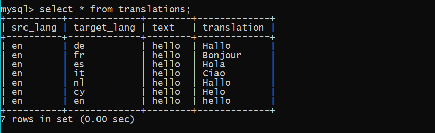
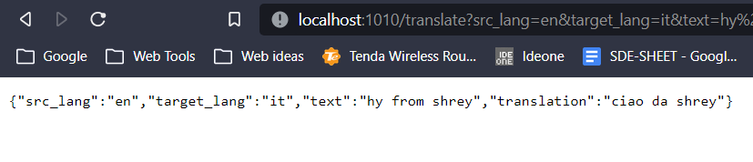
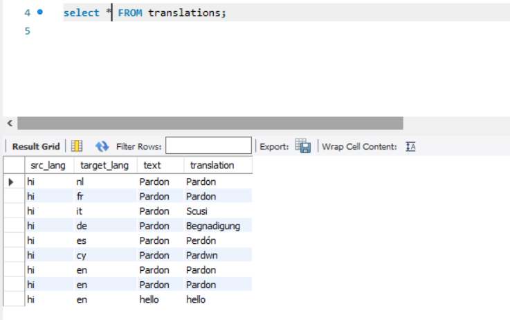

# Translation-Caching
A web server that exposes an API to translate a text

## Target

Create a web server to translate a text from one language to another. 

## Requirements

1. Node
2. MySQL
3. VS Code

## Tech Stack

1. Javascript: Primary programming language
2. NodeJS: Javascript runtime environment
3. ExpressJS: Backend Framework
4. MySQL: Database for storing translations
5. External API: Google-Translate API (for actual translations)

## Approach

This is a Web Server which can be used by an individual looking to translate text from one language to the desired language. The user is required to provide following three fields : -

    - Source language code
    - Target language code
    - Text to be translated

## How to setup and run the server
- Clone the repository from github (https://github.com/shreysingh8838/Translation-Caching)
- Open it in a code editor (VScode preferred)
- For the MySQL database connection you have to specify the port, host, user and the password in all the 4 modules which are db, route, smartCache, cacheMiddleware according to   your MySQL database.
- Install all the dependencies present in package.json with following command
     -npm i dependency@lastest_version --save
     -npm install dotenv@google-cloud/translate --save (for the api, use this command)
 - Define the port number in index.json (I have set it 1010 as of now)
 - Run index.json with following command
     node index
  -Server is ready. Run the request in this format 
  http://localhost:1010/translate?src_lang=en&target_lang=it&text=Pardon 

## Cache Database Schema
```
 |__translations
            |___ src_lang
            |___ target_lang
            |___ text
            |___ translation

```



## Design Decisions
 - Used MySQL as the database since there would be three fields provided by the user and a fourth field would be the translated text, and for managing these four fields it's   best to store the data in the form of table
 - For the smartcaching, it stores the translation of the given text in all the languages related to the target language because a user is also likely to translate the same text to the related languages
 - The Router is designed in such a way that if the demanded text is already present in the database, then the server would not hit translate API and would return the translations directly from the database

## Generating the API
- Use https://console.cloud.google.com/ for generating API KEY from your service account. Now, enable the cloud translate API
(It will ask for the billing address but wouldn't charge for less than 50 request per day)

> **Note:** As of now, credentials of the API will be sent through the mail so I have removed the credentials from the code I am uploading here. Please find it in the mail

## How it works?

1. As and when index.js is run on the command prompt a connection is created with the database and a new database is created named translate_data, a table is created in the database named translations with four fields namely src_lang (source language), target_lang, text (input), translation (output) and the server with the specified port number starts.

2. Now the user is required to provide the query in a browser in the above mentioned format.

3. Firstly query is routed to cacheMiddleware. If the same input fields matches with already present data in the database, translation along with the source language, target language and the text is fetched else it is routed to smartCache.

4. Now we have a list of similar languages in which we have already defined related languages. Translations in all the related languages are made through translate API and stored in the database and the query is back to route from where we send the output along with the other fields to the user.

## Result Evaluation
-Following is the result for converting "hy from shrey" source_lang = english to target_lang=italian



-I verified my code for different test cases and checked that it shouldn't contain similar data in the database. If the data is already available for the given input it should return the output from there only and should not hit the API for that. I checked the database for the same with different and similar queries, and also checked for the different sections of the code so that only that part of the code works which is required for the particular query. 

Translation for "hello"


Translations for similar languages (Smart Caching)



## NPM packages used

    - mysql2
    - dotenv
    - body-parser
    - @google-cloud/translate
    - nodemon
## Further Improvements
Instead of taking language code from the user we can just have the name of the source and the target language. A separate table can be created in the database in which we can store the languages with their language codes and then get the language code from the database to pass it to the API.

I have added a code for language detection in shrey_translate_detect_demo.js

## Author

Name: Shrey Singh

Email: zehen8838@gmail.com

Phone No.: +91 8700307258

https://github.com/shreysingh8838
